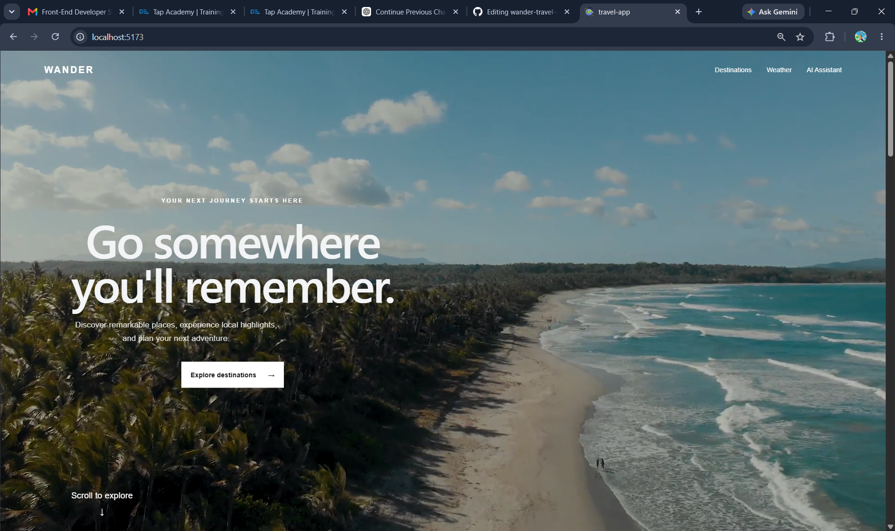

# WANDER — Travel Discovery & AI Trip Planner

## Overview

WANDER is a modern travel discovery website designed to help users explore destinations, check weather conditions, discover popular places, and plan trips with the help of an AI travel assistant.

The application combines a responsive travel-focused interface with external APIs to provide destination images, real-time weather information, and AI-generated travel itineraries.

## Features

* 🌍 Explore popular travel destinations
* 🔎 Search and filter destinations
* 📍 View detailed information about individual destinations
* 🏛️ Discover popular places within each destination
* 🖼️ Fetch place images dynamically using the Pexels API
* 🌤️ Check current weather for a city
* 📍 Get weather using the user's current location
* 🤖 AI travel assistant for travel-related questions
* 🗓️ Generate AI-powered travel itineraries
* 📱 Responsive design for desktop and mobile devices
* 🎬 Full-screen hero section with background video
* ⌨️ Keyboard-friendly interactive elements
* ⚠️ Loading, error, and empty search states

## Screenshots

### Home / Hero Section



### Destinations


### Destination Details


### Weather


### AI Travel Assistant


## Technologies Used

### Frontend

* React.js
* Vite
* JavaScript
* HTML
* CSS
* React Router

### Backend

* Node.js
* Express.js

### APIs

* Pexels API — destination and place images
* OpenWeather API — current weather information
* Google Gemini API — AI travel assistant and itinerary generation

## Project Structure

```text
wander-travel-website/
│
├── src/
│   ├── components/
│   │   ├── AIAssistant.jsx
│   │   └── Weather.jsx
│   │
│   ├── data/
│   │   └── destinations.js
│   │
│   ├── pages/
│   │   └── DestinationDetails.jsx
│   │
│   ├── services/
│   │   └── imageService.js
│   │
│   ├── App.jsx
│   └── App.css
│
├── backend/
│   ├── server.js
│   └── package.json
│
├── public/
│   └── videos/
│
├── package.json
└── README.md
```

## How to Run the Project

### 1. Clone the repository

```bash
git clone https://github.com/bindu-19-code/wander-travel-website.git
```

### 2. Open the project

```bash
cd wander-travel-website
```

### 3. Install frontend dependencies

```bash
npm install
```

### 4. Create the frontend environment file

Create a `.env` file in the project root:

```env
VITE_PEXELS_API_KEY=your_pexels_api_key
VITE_WEATHER_API_KEY=your_openweather_api_key
```

### 5. Start the frontend

```bash
npm run dev
```

The frontend will run on the local development server provided by Vite.

### 6. Set up the backend

Open another terminal:

```bash
cd backend
npm install
```

Create a `.env` file inside the `backend` folder:

```env
GEMINI_API_KEY=your_gemini_api_key
```

### 7. Start the backend

```bash
node server.js
```

The Express backend will start on the configured port.

## API Configuration

The application uses external APIs for its main dynamic features:

* **Pexels API** — retrieves images for destinations and popular places.
* **OpenWeather API** — retrieves current weather information.
* **Google Gemini API** — powers the AI travel assistant and itinerary generation.

API keys should be stored in environment variables and should not be committed to the repository.

## Deployment

The frontend is deployed using Vercel and the backend is deployed using Render.

## Author

**Bindu K Reddy**

Built as a Front-End Developer project assessment.
